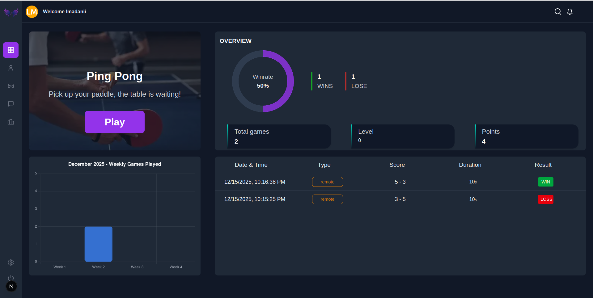
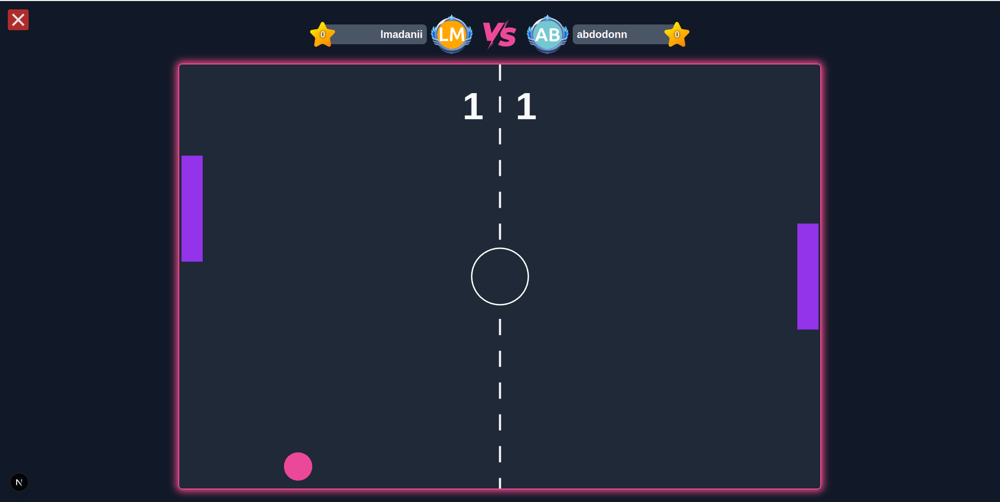
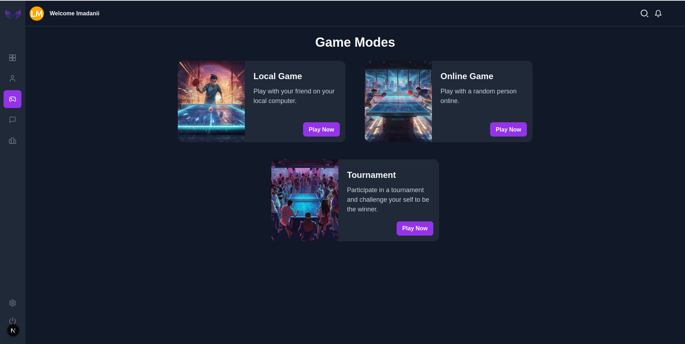
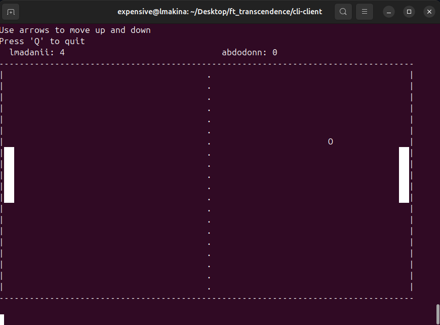

# Pong-Wing (ft_transcendence)

**Pong-Wing** is a full-stack web application built as part of the 42 curriculum. It features a real-time multiplayer Pong game with a dynamic online tournament system, user authentication, profiles, and a chat system. The project is architected as a collection of microservices, each running in its own Docker container, with comprehensive monitoring and centralized logging.







## Table of Contents

- [Project Overview](#project-overview)
- [Architecture](#architecture)
- [Features](#features)
- [Technology Stack](#technology-stack)
- [Monitoring & Alerting](#monitoring--alerting)
- [Logging](#logging)
- [Getting Started](#getting-started)
- [Project Structure](#project-structure)
- [Game Service API](#game-service-api)
- [CLI Client](#cli-client)
- [Contributors](#contributors)
- [Troubleshooting](#troubleshooting)

## Project Overview

This project implements a complete Pong gaming platform with the following core components:

- **Microservices Architecture**: Backend services communicate via REST APIs, ensuring scalability and maintainability.
- **Real-Time Communication**: Socket.io enables real-time game updates, tournament management, and chat functionality.
- **Dynamic Tournament System**: Players can join tournaments with a variable number of participants, playing in turns online.
- **Multi-Client Support**: Play via web browser or terminal-based CLI client.
- **Production-Ready Monitoring**: Prometheus, Grafana, Alertmanager, and Thanos track system health and performance.
- **Centralized Logging**: ELK Stack (Elasticsearch, Logstash, Kibana) aggregates logs from all services.
- **Simple Build Process**: Use `make` for development (`make dev`) or production (`make`), and `make down` to stop containers.

## Architecture

The application follows a microservices architecture with containerized services orchestrated by Docker Compose:

```
┌─────────────────────────────────────────────────────────┐
│                      Nginx (Reverse Proxy)              │
│                    (HTTPS, Port 443)                    │
└────────────┬────────────────────────────────────────────┘
             │
    ┌────────┴───────┬─────────────┬─────────────┐
    │                │             │             │
┌───▼────┐    ┌──────▼─────┐  ┌────▼────────┐  ┌─▼──────────┐
│ Next.js│    │ Game Svc   │  │  User Svc   │  │ Chat Svc   │
└────────┘    └────────────┘  └─────────────┘  └────────────┘
```

### Core Services

1. **Nginx**: Reverse proxy handling HTTPS termination and routing traffic to frontend and backend services.
2. **Next.js Frontend**: React-based UI for the web application, providing the user interface for games, profiles, and chat.
3. **Game Service**: Handles game logic, tournament management, and exposes Socket.io events for real-time gameplay. Can be integrated into external applications via Socket.io API.
4. **User Service**: Manages user accounts, authentication, authorization, and user profiles via REST API.
5. **Chat Service**: Powers real-time chat functionality using Socket.io.

### Observability Stack

**Monitoring Components:**
- **Prometheus**: Time-series database that scrapes metrics from all services and infrastructure.
- **Grafana**: Visualization tool with custom dashboards for performance monitoring.
- **Alertmanager**: Handles alert routing, deduplication, and grouping.
- **Thanos**: Provides long-term metric storage for historical analysis and high availability.
- **Node Exporter**: Exposes host-level metrics (CPU, memory, disk, network).
- **cAdvisor**: Container-level resource usage monitoring.
- **Nginx Exporter**: Nginx-specific performance metrics.
- **Discord Alerts**: Routes critical alerts to Discord webhooks for instant notification.

**Logging Components:**
- **Elasticsearch**: Distributed search and analytics engine for log storage and indexing.
- **Logstash**: Server-side data processing pipeline for log ingestion, parsing, and forwarding.
- **Kibana**: Web interface for searching, visualizing, and analyzing logs.
- **Setup Service**: Initializes certificates, security, and user credentials for the ELK stack.

## Features

### Core Gameplay

- ✅ **Real-time Multiplayer Pong**: Play against other users in real-time with instant synchronization.
- ✅ **Dynamic Tournament System**: Host tournaments with any number of players; players take turns playing online automatically.
- ✅ **User Authentication & Authorization**: Secure login with session management and role-based access control.
- ✅ **User Profiles**: View player statistics, match history, win-loss records, and achievements.
- ✅ **Real-Time Chat**: Chat with other players using Socket.io for instant messaging.
- ✅ **Game Service Socket.io API**: Publicly exposed Socket.io events to integrate game functionality into external applications.
- ✅ **CLI Client**: Play Pong directly from the terminal against browser users. Includes terminal-based ASCII game canvas visualization.

### Observability & Operations

- ✅ **Comprehensive Metrics Collection**: Prometheus scrapes metrics from all services, containers, and infrastructure.
- ✅ **Custom Dashboards**: Grafana dashboards visualizing system health, performance, and resource utilization.
- ✅ **Automated Alerting**: Alert rules for critical conditions with Discord webhook integration.
- ✅ **Centralized Logging**: All service logs aggregated in Kibana for analysis, debugging, and compliance.
- ✅ **Long-Term Storage**: Thanos integration for persistent metric retention beyond short-term Prometheus storage.
- ✅ **Health Checks**: Built-in health checks for all services to ensure system availability.

## Technology Stack

### Frontend
- **Next.js**: Modern React framework for server-side rendering and static generation.
- **TypeScript**: Type-safe JavaScript for code reliability.
- **TailwindCSS**: Utility-first CSS framework for responsive design.
- **Socket.io Client**: Real-time communication with the backend.

### Backend Services
- **Node.js**: JavaScript runtime environment.
- **Fastify**: High-performance web framework for building APIs.
- **SQLite**: Lightweight embedded SQL database.
- **Socket.io**: Real-time bidirectional event-based communication.
- **Microservices Pattern**: Each service independently deployable, scalable, and maintainable.

### Infrastructure & Containerization
- **Docker**: Containerization platform for consistent deployments.
- **Docker Compose**: Orchestration for local development and containerized deployment.
- **Nginx**: Reverse proxy, load balancer, and HTTPS terminator.
- **Make**: Build automation for easy project management.

### Monitoring & Logging
- **Prometheus v3.5.0**: Metrics collection and time-series database.
- **Grafana**: Metrics visualization and dashboarding.
- **Alertmanager v0.23.0**: Alert management, deduplication, and routing.
- **Thanos v0.10.1**: Long-term metric storage and querying.
- **Elasticsearch**: Log indexing and full-text search.
- **Logstash**: Log processing, parsing, and pipeline orchestration.
- **Kibana**: Log visualization and analysis interface.

### Security
- **TLS/SSL**: HTTPS encryption with certificate management.
- **Credential Management**: Secure credential handling via environment variables.

## Monitoring & Alerting

The project includes a comprehensive monitoring and alerting stack to ensure reliability, performance, and visibility across all services and infrastructure.

**For detailed information about the monitoring setup, configuration, dashboards, and alerting rules, see the [Monitoring & Alerting README](https://github.com/HamzaOuamrhar/ft_transcendence/blob/main/README.md#-infrastructure-setup-with-elk-stack-for-log-management).**

### Quick Access

- **Grafana Dashboards**: `https://localhost/grafana`
- **Prometheus UI**: `https://localhost/prometheus`
- **Alertmanager**: `https://localhost/alertmanager`

### Key Monitoring Features

- Real-time metric collection from all services
- Custom dashboards tracking game performance, user activity, and system health
- Automated alerts for critical conditions (service down, high resource usage, etc.)
- Discord integration for instant alert notifications
- 6-month metric retention with Thanos for historical analysis

## Logging

A centralized logging system based on the Elastic Stack (ELK) aggregates logs from all services, enabling efficient debugging, root cause analysis, security investigation, and compliance.


### Quick Access

- **Kibana Dashboard**: `https://localhost/kibana`

### Key Logging Features

- Centralized log aggregation from all services
- Full-text search and filtering capabilities
- Real-time log analysis and visualization
- Secure authentication and encryption
- Long-term log retention for audit and compliance

## Getting Started

### Prerequisites

- Docker and Docker Compose (v1.29+)
- Git
- Make (for build automation)
- Environment files configured for each service

### Quick Start

1. **Clone the repository**:
   ```bash
   git clone git@github.com:AghlaAbdo/ft_transcendence.git
   cd ft_transcendence
   ```

2. **Create environment files**:
   
   Create a `.env` file in the project root:
   ```bash
   cp .env.example .env
   ```
   
   Each microservice also requires its own `.env` file. Create them from the provided `.env.example` templates:
   ```bash
   # Frontend
   cp frontend/.env.example frontend/.env
   
   # Game Service
   cp services/game-service/.env.example services/game-service/.env
   
   # User Service
   cp services/user-service/.env.example services/user-service/.env
   
   # Chat Service
   cp services/chat-service/.env.example services/chat-service/.env
   ```
   

3. **Build and run the project**:
   ```bash
   # For production
   make

   # For development
   make dev

   # To stop all containers
   make down
   ```

4. **Verify services are running**:
   ```bash
   docker-compose ps
   ```

5. **Access the application**:
   - **Web Application**: `https://localhost`
   - **Grafana**: `https://localhost/grafana`
   - **Kibana**: `https://localhost/kibana`
   - **Prometheus**: `https://localhost/prometheus`
   - **Alertmanager**: `https://localhost/alertmanager`

### Development Workflow

For local development without full monitoring:
```bash
# Start only essential services
docker-compose up -d nginx nextjs game-service user-service chat-service

# View logs from a specific service
docker-compose logs -f <service-name>

# Rebuild a single service
docker-compose up --build -d <service-name>
```

## Project Structure

```
ft_transcendence/
├── Makefile                        # Build automation
├── docker-compose.yml              # Service orchestration
├── docker-compose.dev.yml          # For development build
├── docker-compose.prod.yml         # For production build
├── .env.example                    # Environment variables template
├── README.md                       # This file
│
├── frontend/                       # Next.js web application
│   ├── Dockerfile
│   ├── package.json
│   ├── pages/
│   ├── components/
│   └── ...
│
├── services/                       # Microservices
│   ├── nginx/                      # Reverse proxy & HTTPS terminator
│   │   ├── Dockerfile
│   │   ├── nginx.conf
│   │   └── ...
│   ├── game-service/               # Game logic & tournament
│   │   ├── Dockerfile
│   │   ├── src/
│   │   ├── package.json
│   │   └── ...
│   ├── user-service/               # User management & authentication
│   │   ├── Dockerfile
│   │   ├── src/
│   │   ├── package.json
│   │   └── ...
│   └── chat-service/               # Real-time chat
│       ├── Dockerfile
│       ├── src/
│       ├── package.json
│       └── ...
│
├── cli-client/                     # Terminal-based Pong client
│   ├── src/
│   ├── package.json
│   └── ...
│
├── monitoring/                     # Prometheus & Grafana configuration
│   ├── README.md                   # Monitoring documentation
│   ├── prometheus.yml              # Prometheus scrape configuration
│   ├── alert_rules.yml             # Alerting rules
│   ├── alertmanager.yml            # Alert routing configuration
│   ├── objstore.yml.template       # Thanos object storage config
│   ├── thanos-entrypoint.sh        # Thanos startup script
│   ├── cadvisor/                   # Container monitoring
│   │   └── Dockerfile
│   └── ...
│
├── elk-stack/                      # Elasticsearch, Logstash, Kibana stack
│   ├── README.md                   # ELK documentation
│   ├── elasticsearch/
│   │   ├── Dockerfile
│   │   ├── config/
│   │   └── ...
│   ├── logstash/
│   │   ├── Dockerfile
│   │   ├── config/
│   │   │   └── logstash.yml
│   │   ├── pipeline/
│   │   │   └── logstash.conf
│   │   └── ...
│   ├── kibana/
│   │   ├── Dockerfile
│   │   ├── config/
│   │   └── ...
│   ├── setup/
│   │   ├── Dockerfile
│   │   ├── utils/
│   │   │   └── instances.yml
│   │   ├── dashboard.ndjson
│   │   └── ...
│   └── ...
│
├── logs/                           # Application logs (mounted volume for Logstash)
└── .gitignore
```

## Game Service API

The Game Service exposes a **Socket.io API** for real-time game events, allowing third-party developers to integrate Pong gameplay and tournament functionality into external applications.

### Connection

```javascript
import io from 'socket.io-client';

const socket = io('https://localhost', {
  path: '/ws/game',
  auth: {
    token: 'your-jwt-token' // For CLI clients or custom integrations
  },
  reconnection: true,
  reconnectionDelay: 1000,
  reconnectionDelayMax: 5000,
  reconnectionAttempts: 5
});
```

**Note**: Browser clients can send tokens via HttpOnly cookies, while CLI and external clients should send the token in the `auth` object.

### Authentication

All Socket.io connections require a valid JWT token. The middleware will verify the token and reject connections without one.

### Quick Match Events

#### `play`
Initiate matchmaking for a quick game.

```javascript
socket.emit('play', userId);
```

**Parameters**:
- `userId` (string): The ID of the user joining matchmaking

**Server Response**: Emits `gameCreated` or adds user to matchmaking pool

#### `movePaddle`
Send paddle movement during gameplay.

```javascript
socket.emit('movePaddle', gameId, playerRole, direction);
```

**Parameters**:
- `gameId` (string): The ID of the active game
- `playerRole` (string): Player role identifier (e.g., 'player1', 'player2')
- `direction` (string): Movement direction ('up' or 'down')

#### `gameOver`
Notify that the game has ended (client-side game completion).

```javascript
socket.emit('gameOver');
```

#### `quit`
Leave or forfeit the current game.

```javascript
socket.emit('quit', {
  userId: 'user-123',
  gameId: 'game-456',
  opponentId: 'opponent-789' // Optional
});
```

#### `cancelMatching`
Cancel matchmaking request.

```javascript
socket.emit('cancelMatching', {
  userId: 'user-123',
  gameId: 'game-456'
});
```

#### `requestMatchDetails`
Request current match state and game data.

```javascript
socket.emit('requestMatchDetails', userId);
```

**Server Response**: Emits match state with ball position, paddle positions, scores, etc.

#### `quitRemoteGamePage`
Quit the game page on another client/browser.

```javascript
socket.emit('quitRemoteGamePage', {
  userId: 'user-123',
  gameId: 'game-456'
});
```

### Tournament Events

#### `createTournament`
Create a new tournament.

```javascript
socket.emit('createTournament', userId, maxPlayers, tournamentName);
```

**Parameters**:
- `userId` (string): The creator's user ID
- `maxPlayers` (number): Maximum number of players allowed
- `tournamentName` (string): Name of the tournament

#### `joinTournament`
Join an existing tournament.

```javascript
socket.emit('joinTournament', userId, tournamentId);
```

**Parameters**:
- `userId` (string): The user's ID
- `tournamentId` (string): The tournament's ID

#### `requestTournaments`
Request list of all available tournaments.

```javascript
socket.emit('requestTournaments', { userId: 'user-123' });
```

**Server Response**: Emits list of tournaments with details

#### `requestTournamentDetails`
Get detailed information about a specific tournament.

```javascript
socket.emit('requestTournamentDetails', userId, tournamentId);
```

**Parameters**:
- `userId` (string): The requesting user's ID
- `tournamentId` (string): The tournament's ID

**Server Response**: Emits tournament details including bracket, players, and match schedule

#### `leaveTournamentLobby`
Leave a tournament lobby before it starts.

```javascript
socket.emit('leaveTournamentLobby', {
  userId: 'user-123',
  tournamentId: 'tournament-456'
});
```

#### `tourn:inLoby`
Indicate that a player is in the tournament lobby.

```javascript
socket.emit('tourn:inLoby', {
  userId: 'user-123',
  tournamentId: 'tournament-456'
});
```

#### `tourn:readyForMatch`
Mark as ready for the next tournament match.

```javascript
socket.emit('tourn:readyForMatch', {
  userId: 'user-123',
  tournamentId: 'tournament-456',
  gameId: 'game-789'
});
```

#### `unreadyForMatch`
Mark as not ready (unready) for a match.

```javascript
socket.emit('unreadyForMatch', { userId: 'user-123' });
```

#### `quitTournament`
Withdraw from the tournament.

```javascript
socket.emit('quitTournament', {
  userId: 'user-123',
  tournamentId: 'tournament-456'
});
```

#### `requestTournMatchDetails`
Get details for a specific tournament match.

```javascript
socket.emit('requestTournMatchDetails', {
  userId: 'user-123',
  tournamentId: 'tournament-456',
  matchGameId: 'game-789'
});
```

**Server Response**: Emits match state and game data for the requested match

### Game Invite Events

#### `getGameInviteMatch`
Request or retrieve a game invitation match.

```javascript
socket.emit('getGameInviteMatch', {
  gameId: 'game-123',
  userId: 'user-456'
});
```

#### `leaveGameInvite`
Leave or decline a game invitation.

```javascript
socket.emit('leaveGameInvite', {
  userId: 'user-123',
  gameId: 'game-456'
});
```

### Server-Emitted Events (Listening)

Your client should listen for these events from the server:

```javascript
// Game state updates
socket.on('gameState', (state) => {
  console.log('Ball position:', state.ball);
  console.log('Paddles:', state.paddles);
  console.log('Score:', state.score);
});

// Tournament updates
socket.on('tournamentUpdate', (tournament) => {
  console.log('Tournament bracket:', tournament.bracket);
  console.log('Current matches:', tournament.currentMatches);
});

// Game created notification
socket.on('gameCreated', (gameData) => {
  console.log('Game started:', gameData.gameId);
});

// Match found notification
socket.on('matchFound', (opponent) => {
  console.log('Opponent found:', opponent.username);
});

// Tournament match ready
socket.on('tournamentMatchReady', (matchData) => {
  console.log('Your match is ready:', matchData);
});

// Disconnection events
socket.on('disconnect', (reason) => {
  console.log('Disconnected:', reason);
});
```

### Error Handling

```javascript
socket.on('error', (error) => {
  if (error === 'NO_TOKEN') {
    console.error('No authentication token provided');
  } else if (error === 'INVALID_TOKEN') {
    console.error('Authentication token is invalid or expired');
  }
});

socket.on('connect_error', (error) => {
  console.error('Connection error:', error.message);
});
```

For complete documentation and implementation examples, refer to the CLI client implementation in `/cli-client`.

## CLI Client

The **CLI Client** (`/cli-client`) enables players to participate in Pong games directly from the terminal. It provides a fully functional gaming experience in text-based environments.

### Features

- **Terminal-Based Gameplay**: Play Pong using keyboard controls in the terminal.
- **Game Canvas Visualization**: Real-time ASCII/Unicode rendering of the game board, paddles, and ball.
- **Multiplayer Support**: Play against both browser-based users and other CLI players.
- **Tournament Integration**: Seamlessly participate in online tournaments from the command line.
- **User Authentication**: Login and profile management from the terminal.

### Installation & Usage

```bash
# Navigate to CLI client directory
cd cli-client

# Install dependencies
npm install

# Build the CLI client
npm run build

# Start the CLI client
npm run start
```

### Gameplay Controls

- **↑/↓ Arrow Keys**: Move paddle up/down
- **Play**: Start matching with opponent
- **Q**: Quit game or menu
- **Tab**: Switch between windows/panels


## Contributors

This project was developed by a team of 4 students as part of the 1337 curriculum:

- [Abdellatif Aghla](https://github.com/AghlaAbdo)
- [Ayoub Ben Chafai](https://github.com/aben-cha)
- [Imad Ez-zaghba](https://github.com/ASTRO-47)
- [Hamza Ouamrhar](https://github.com/HamzaOuamrhar)

Made with ❤️ @ 1337

## Troubleshooting

### Services fail to start

**Problem**: Containers exit immediately or fail to start.

**Solutions**:
- Check Docker is running: `docker ps`
- Review logs: `docker-compose logs <service-name>`
- Ensure all environment variables are set in `.env`
- Verify port 443 is not in use: `lsof -i :443`

### Certificate issues

**Problem**: SSL/TLS certificate errors when accessing services.

**Solutions**:
```bash
# Remove certificate volumes
docker volume rm certs certs-ca grafana-certs

# Rebuild and restart
make clean
make
```

### Metrics not appearing in Grafana

**Problem**: Grafana dashboards show no data or "No data".

**Solutions**:
1. Verify Prometheus is scraping targets: `https://localhost/prometheus/targets`
2. Check Prometheus logs: `docker-compose logs prometheus`
3. Ensure exporters are running: `docker-compose ps | grep exporter`
4. Verify datasource in Grafana: Configuration → Data Sources → Prometheus

### Logs not appearing in Kibana

**Problem**: Kibana shows no logs or empty index.

**Solutions**:
1. Verify Elasticsearch is healthy:
   ```bash
   docker-compose logs elasticsearch
   docker-compose ps elasticsearch
   ```
2. Check Logstash is running and processing logs:
   ```bash
   docker-compose logs logstash
   ```
3. Ensure applications are writing logs to `./logs` volume
4. Create Kibana index pattern: Management → Index Patterns → Create Index Pattern

### Connection refused errors

**Problem**: "Connection refused" when accessing services.

**Solutions**:
- Wait 30-60 seconds for all services to fully initialize (especially Elasticsearch)
- Check service health: `docker-compose ps`
- Verify firewall allows port 443
- Check nginx logs: `docker-compose logs nginx`

### High memory/CPU usage

**Problem**: Docker containers consuming excessive resources.

**Solutions**:
- Check resource usage: `docker stats`
- Review Grafana dashboards for problematic services
- Check Elasticsearch JVM settings in docker-compose.yml
- Monitor Prometheus retention: review `--storage.tsdb.retention.size` setting

### Game service not responding

**Problem**: Cannot join games or Socket.io connections fail.

**Solutions**:
1. Check game-service logs: `docker-compose logs game-service`
2. Verify Socket.io port is exposed: check nginx configuration
3. Test connection: `curl -i https://localhost` to verify reverse proxy
4. Check user authentication: ensure you're logged in before joining games

## License

This project is part of the 42 curriculum.

## Acknowledgments

- 42 School for the curriculum and learning opportunity
- Open-source communities for Prometheus, Grafana, Elasticsearch, and other tools
